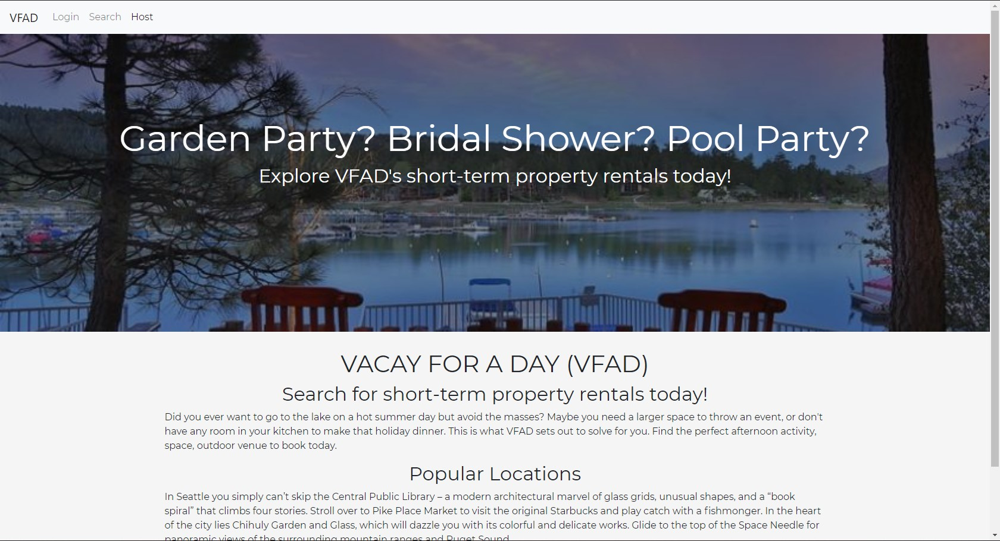

# VFAD

This web app is a full-stack app that was built to run similar to that of VRBO and AirBnB. The idea of this app is to allow users to focus more on a single day rental for spontaneous events, such as renting a backyard with beach access when all the other beaches are packed with public users, or if you just need someone's glamorous garden for a photoshoot. Users can set up an account as a renter or a rentee. The renter will have the ability to add photos and info of their properties they want to open up for rental. Where the rentee's account will allow them to setup booking for a rental.

## Getting Started

### Prerequisites
* A basic understanding of HTML/CSS.
* Bootstrap is used, but not necessary.
* An intermediate experience of JavaScript.
* Understanding of JQuery.
* Understand the basics of React.
* Knowledge of Node and Express Web Server

### Installing

1) Clone this repo to your desktop.
You will start out with the base code to get you up and running.
2) NPM Install (installs packages)

## Directions
Either create an account as a renter or rentee. Once account created, input information of property if renter; input search preferences for properties if a rentee. 

## Deployment
Web page deployed using Heroku.

[VFAD] https://vfad2.herokuapp.com/

[GitHub] https://github.com/JKGills12/vfad3

